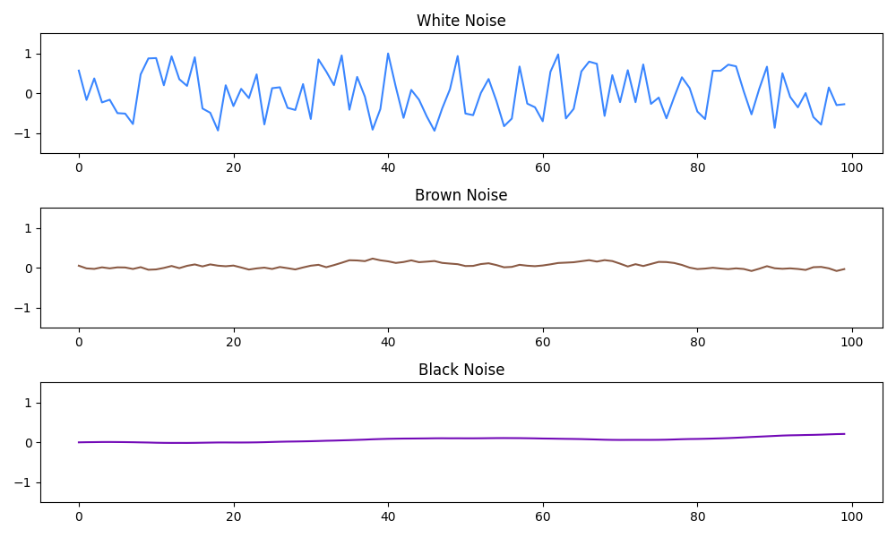
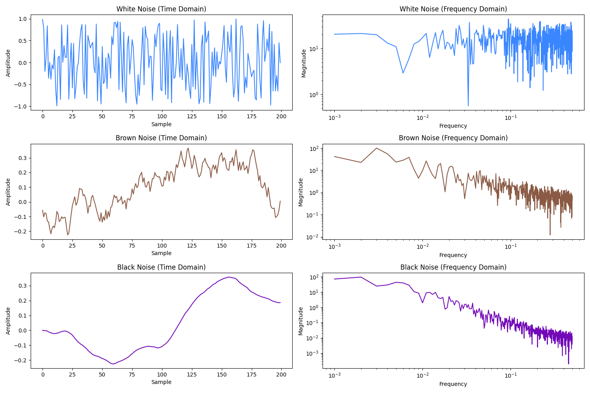

# Web Audio Noise Generator

A standalone web application for generating different types of audio noise, with recording capabilities and a user-friendly interface.

## What This Application Does

This noise generator creates different types of audio noise using the Web Audio API. It's useful for:

- Sound masking in noisy environments
- Relaxation and sleep aid
- Audio testing and calibration
- Meditation and focus enhancement
- Tinnitus management

## Features and Capabilities

- **Multiple Noise Types**: Generate white, brown, pink, and black noise
- **Volume Control**: Adjust the volume of the generated noise
- **Recording**: Record the generated noise for later use
- **Audio Export**: Save recordings in various formats
- **Responsive Design**: Works on both desktop and mobile devices
- **Keyboard Shortcuts**: Control the application using keyboard shortcuts
- **Visual Feedback**: Audio visualization shows the noise characteristics

## How to Use

1. **Open the Application**: Simply open the index.html file in a web browser
2. **Select Noise Type**: Choose from white, brown, pink, or black noise
3. **Adjust Volume**: Use the slider to set your preferred volume level
4. **Play/Stop**: Click the play button to start generating noise, click stop to end
5. **Recording**: 
   - Click the record button to start recording
   - Click stop recording when finished
   - Download your recording using the download button

### Keyboard Shortcuts

- **Space**: Play/Pause noise generation
- **Up/Down Arrows**: Increase/Decrease volume
- **1-4**: Switch between noise types (1=White, 2=Brown, 3=Pink, 4=Black)
- **R**: Start/Stop recording
- **H**: Show/Hide help panel

## Browser Compatibility

The application works best in modern browsers with full Web Audio API support:

- Chrome 35+
- Firefox 25+
- Safari 14+
- Edge 79+
- Opera 22+

## Known Limitations

- **Mobile Browser Restrictions**: Some mobile browsers may limit audio playback without user interaction
- **Recording Time Limits**: Browser-imposed limits on recording duration may apply
- **Audio Processing**: High-quality noise generation can be CPU-intensive on older devices
- **Autoplay Restrictions**: Most browsers require user interaction before playing audio
- **Safari Compatibility**: Some advanced features may have limited functionality in Safari

## Technical Implementation

The noise generator uses modern Web Audio API features:

- AudioContext for audio processing
- AudioWorklet for efficient noise generation
- MediaRecorder API for audio recording
- Responsive design for cross-device compatibility

No external libraries or dependencies are required - the application is completely self-contained in the index.html file.